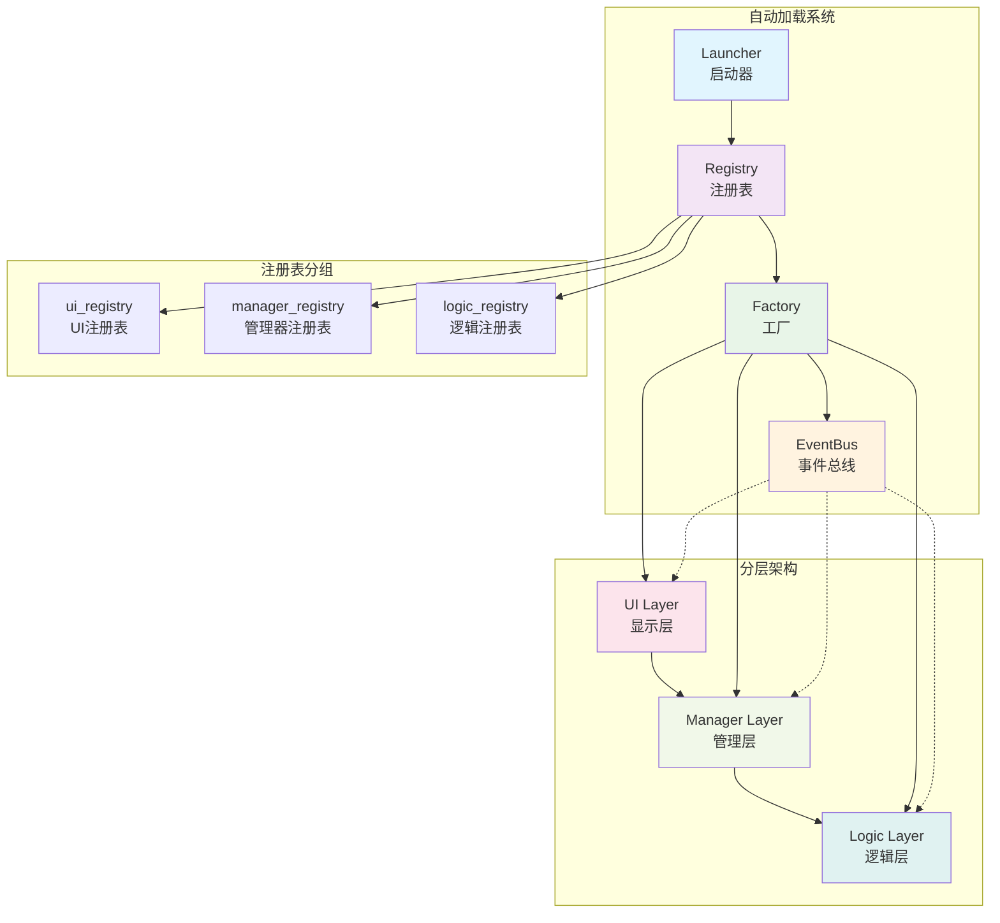

# Godot 游戏模板项目

一个基于Godot 4.5的游戏开发模板，采用清晰的分层架构和设计模式，为游戏开发提供可扩展的基础框架。

## 🏗️ 项目架构

### 核心设计模式

本项目采用了多种设计模式来确保代码的可维护性和可扩展性：

- **服务定位器模式**：通过Registry实现依赖管理
- **工厂模式**：通过Factory统一对象创建
- **观察者模式**：通过EventBus实现组件解耦
- **MVC模式**：清晰的分层架构

### 自动加载系统

项目包含4个核心自动加载节点，按加载顺序排列：

1. **Registry（注册表）**
   - 负责管理所有需要被其他节点查找的对象
   - 支持分组管理：`ui_registry`、`manager_registry`、`logic_registry`
   - 提供统一的注册和查找接口

2. **Factory（工厂）**
   - 统一的对象创建入口
   - 自动将创建的对象注册到Registry
   - 支持创建UI、逻辑和管理器对象

3. **EventBus（事件总线）**
   - 全局信号管理中心
   - 解耦组件间的直接依赖
   - 支持跨层通信

4. **Launcher（启动器）**
   - 游戏启动入口
   - 负责初始化游戏状态

### 分层架构

```
┌─────────────────┐
│   UI Layer      │  ← 显示层，纯UI展示
├─────────────────┤
│ Manager Layer   │  ← 管理层，全局调度
├─────────────────┤
│  Logic Layer    │  ← 逻辑层，数据存储和业务逻辑
└─────────────────┘
```

### 系统架构图



#### 1. Logic Layer（逻辑层）
- **位置**：`scripts/logic/`
- **职责**：数据存储和业务逻辑处理
- **特点**：纯数据类，不依赖UI

#### 2. UI Layer（显示层）
- **位置**：`scripts/ui/`
- **职责**：用户界面展示和交互
- **特点**：只负责显示，不包含业务逻辑

#### 3. Manager Layer（管理层）
- **位置**：`scripts/manager/`
- **职责**：全局管理和组件调度
- **特点**：协调各层之间的交互

## 📁 项目结构

```
template/
├── assets/                 # 资源文件
│   ├── audios/            # 音频资源
│   ├── fonts/             # 字体资源
│   └── textures/          # 纹理资源
├── config/                # 配置文件
├── resources/             # 游戏资源
│   └── shaders/           # 着色器
├── scenes/                # 场景文件
│   ├── main.tscn          # 主场景
│   └── example_ui.tscn    # 示例UI场景
├── scripts/               # 脚本文件
│   ├── autoload/          # 自动加载脚本
│   │   ├── EventBus.gd    # 事件总线
│   │   ├── Factory.gd     # 工厂类
│   │   ├── Launcher.gd    # 启动器
│   │   └── Registry.gd    # 注册表
│   ├── logic/             # 逻辑层脚本
│   ├── manager/           # 管理层脚本
│   ├── ui/                # UI层脚本
│   └── utils/             # 工具类脚本
├── project.godot          # 项目配置
└── README.md              # 项目说明
```

## 🚀 快速开始

### 环境要求
- Godot 4.5+
- 支持GL Compatibility渲染器

### 运行项目
1. 使用Godot打开项目
2. 运行主场景 `main.tscn`

## 💡 使用示例

### 创建对象
```gdscript
# 通过Factory创建对象
var example = Factory.creat_example()
var example_ui = Factory.creat_example_ui()
var example_manager = Factory.creat_example_manager()
```

### 查找对象
```gdscript
# 从Registry查找对象
var example = Registry.registry_find_item("example", "logic_registry")
var example_ui = Registry.registry_find_item("example_ui", "ui_registry")
```

### 事件通信
```gdscript
# 发送事件
EventBus.emit_signal_example()

# 监听事件
EventBus.signal_example.connect(_on_signal_example)

func _on_signal_example():
	print("收到事件")
```

## 🔧 开发指南

### 添加新的逻辑类
1. 在 `scripts/logic/` 创建新的逻辑类
2. 在 `Factory.gd` 中添加创建方法
3. 确保对象注册到 `logic_registry`

### 添加新的UI组件
1. 在 `scripts/ui/` 创建UI脚本
2. 在 `scenes/` 创建对应的场景文件
3. 在 `Factory.gd` 中添加创建方法
4. 确保对象注册到 `ui_registry`

### 添加新的事件
1. 在 `EventBus.gd` 中定义新的信号
2. 添加对应的发射方法
3. 在需要的地方连接和发射事件

## 🎯 架构优势

- **高内聚低耦合**：各层职责明确，依赖关系清晰
- **易于扩展**：新功能可以轻松添加到对应层级
- **便于测试**：分层架构便于单元测试
- **代码复用**：通用组件可以在不同项目中复用

## 📊 代码质量评估

### 当前状态
- ✅ **架构设计优秀**：采用了多种设计模式，结构清晰
- ✅ **分层合理**：UI、Manager、Logic三层职责明确
- ⚠️ **实现不完整**：大部分脚本只有类定义，缺少具体实现
- ⚠️ **错误处理不足**：缺少异常处理和边界情况处理
- ⚠️ **文档待完善**：代码注释过于简单

### 需要改进的地方

1. **Registry缺少重复注册检查**
   - 当前代码会静默忽略重复注册
   - 建议添加警告或错误提示

2. **EventBus功能过于简单**
   - 只有一个示例信号
   - 建议添加更多常用的事件类型

## 🔧 改进建议

### 1. 完善错误处理
```gdscript
# Registry.gd 改进建议
func registry_add_item(item_name: String, item, group_name: String) -> bool:
	var group_index = _find_group(group_name)
	if group_index == -1:
		push_error("Registry group not found: " + group_name)
		return false
	
	var group = group_list[group_index]
	if group.group_find_item(item_name) != null:
		push_warning("Item already exists: " + item_name + " in " + group_name)
		return false
	
	group.group_add_item(item_name, item)
	return true
```

### 2. 增强EventBus功能
```gdscript
# EventBus.gd 改进建议
extends Node

# 游戏状态事件
signal game_started
signal game_paused
signal game_resumed
signal game_ended

# UI事件
signal ui_opened(ui_name: String)
signal ui_closed(ui_name: String)

# 数据事件
signal data_changed(data_type: String, data_value)

# 发射方法
func emit_game_started() -> void:
	game_started.emit()

func emit_ui_opened(ui_name: String) -> void:
	ui_opened.emit(ui_name)
```

### 3. 添加单例模式支持
```gdscript
# 为Manager类添加单例支持
class_name ExampleManager
extends Node

static var instance: ExampleManager

func _init():
	if instance == null:
		instance = self
	else:
		push_error("ExampleManager instance already exists")
```

### 4. 完善Launcher功能
```gdscript
# Launcher.gd 改进建议
extends Node

func _ready():
	_initialize_game()

func _initialize_game():
	# 初始化游戏系统
	_setup_registry()
	_create_managers()
	_setup_ui()
	_start_game()

func _setup_registry():
	# 确保Registry正确初始化
	pass

func _create_managers():
	# 创建必要的管理器
	Factory.creat_example_manager()

func _setup_ui():
	# 设置UI
	Factory.creat_example_ui()

func _start_game():
	# 启动游戏
	EventBus.emit_game_started()
```

## 📝 开发注意事项

- 确保所有对象都通过Registry进行管理
- 使用EventBus进行跨层通信，避免直接引用
- 遵循单一职责原则，每个类只负责一个功能
- 保持代码注释的完整性
- 添加适当的错误处理和日志记录
- 定期进行代码审查和重构

## 🎯 架构总结

### 优势
1. **设计模式应用得当**：服务定位器、工厂、观察者、MVC等模式使用合理
2. **分层架构清晰**：UI、Manager、Logic三层职责明确，便于维护
3. **自动加载系统完善**：Registry、Factory、EventBus、Launcher分工明确
4. **可扩展性强**：新功能可以轻松添加到对应层级
5. **依赖管理良好**：通过Registry统一管理对象生命周期

### 需要改进
1. **代码实现不完整**：大部分类只有定义，缺少具体实现
2. **错误处理不足**：缺少异常处理和边界情况处理
3. **功能单一**：EventBus功能过于简单
4. **文档待完善**：代码注释和文档需要更详细

### 总体评价
这是一个**架构设计优秀但实现不完整**的游戏模板项目。架构设计采用了多种设计模式，结构清晰，具有良好的可扩展性。但代码实现还处于模板阶段，需要进一步完善具体功能、错误处理和文档。

**推荐指数：⭐⭐⭐⭐☆**（架构优秀，实现待完善）

## 🤝 贡献指南

欢迎提交Issue和Pull Request来改进这个模板项目。

## 📄 许可证
